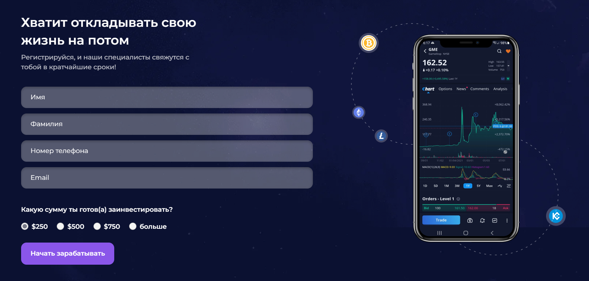

# AssetAce (real order)

[Here you can check it](https://artemuholkov.github.io/AssetAce/)

---

Simple landing page. Company ordered it to send facebook ads on it and reaceive leads.
I had figma design for this project.
This landing page is 100% responsive for all types of screens.
I used HTML, CSS, JS in this project.

---

### What was interesting in this project:

1. Interesting view of main section.


2. Custom form sending data to email and CRM system using php.



```
$data = http_build_query($fields);
$url = 'https://bestcliq.tech/api/v1/AddLead';

if ($curl = curl_init()) {
    curl_setopt($curl, CURLOPT_URL, $url);
    curl_setopt($curl, CURLOPT_RETURNTRANSFER, true);
    curl_setopt($curl, CURLOPT_POST, true);
    curl_setopt($curl, CURLOPT_POSTFIELDS, $data);

    curl_setopt($curl, CURLOPT_SSL_VERIFYPEER, false);
    curl_setopt($curl, CURLOPT_SSL_VERIFYHOST, false);

    $response = curl_exec($curl);

    curl_close($curl);

    $out = json_decode($response, true);

    print_r($out);

}
```
